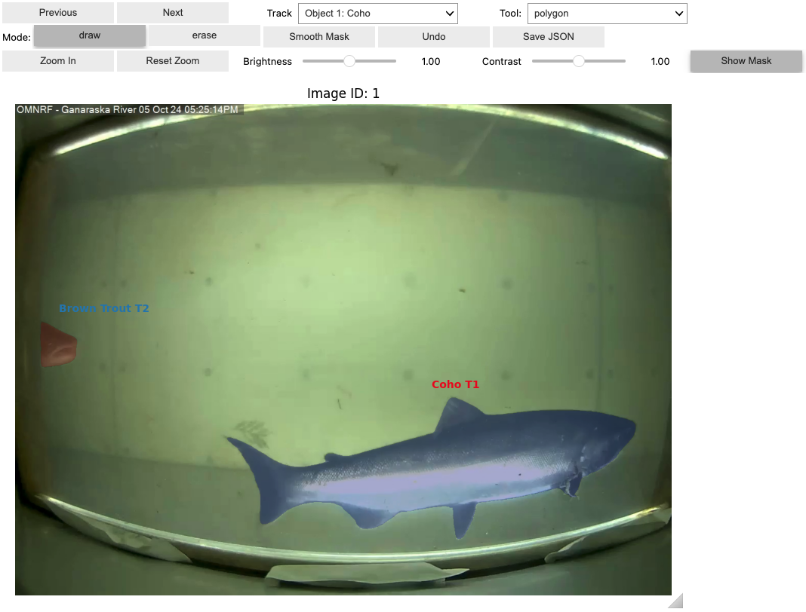
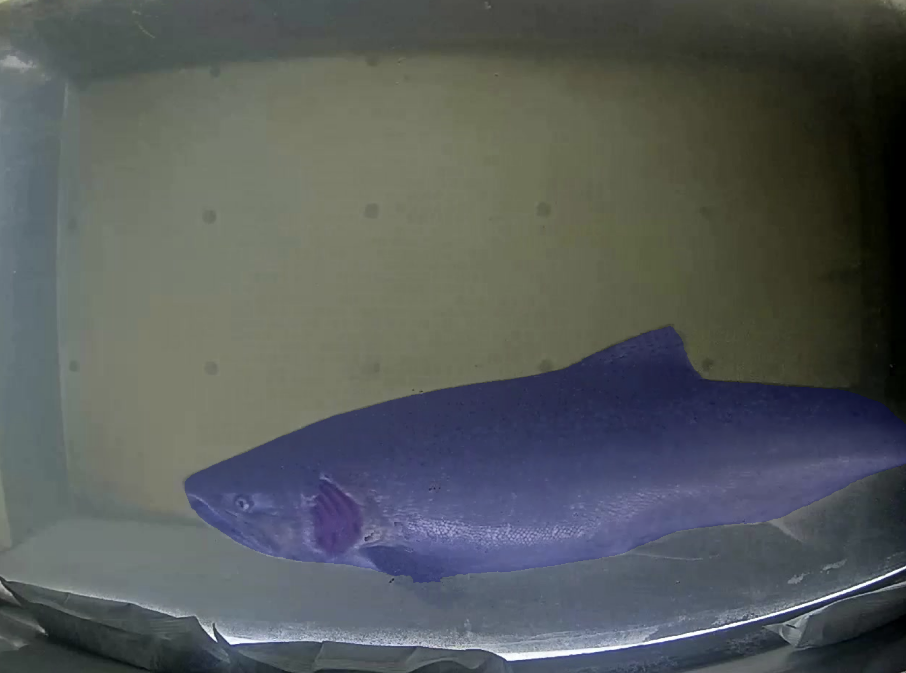
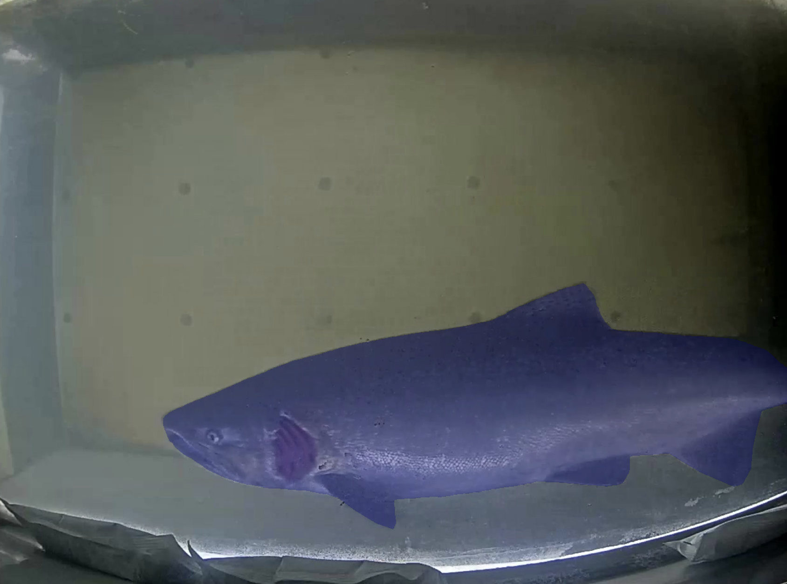
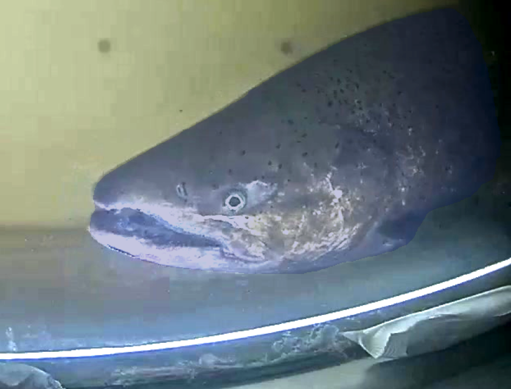

# Installation Instructions and Labelling Guideline

This is a guide for installing all the necessay software and setting up your python environment to run the notebook used to edit generated masks. If you run into any problems during this process feel free to reach out and I can troubleshoot with you! There is also information about how to use the MaskEditor widget and some guidelines for how to label the data.

## Installation and Environment Set Up

### Download and Install Visual Studio Code

Download the appropirate version of VS Code for your operating system from [here](https://code.visualstudio.com/download) and follow the installation instructions. 

### Download and Install Python

Download the latest version of Python for your operating system from [here](https://www.python.org/downloads/) and follow the installation instructions. 

### Create a Python Virtual Environment

1. Create a folder from which you will work on all the labelling tasks. You should place both the labelling_functions.py file and the LO_edit_masks.ipynb file in this directory. 
2. Open the VS Code app and then click on the folder symbol that says "Open..." beside it. Open the folder that you just created above.
3. Create a virtual environment.
4. Open the Command Palette (Shift + Command/Control + P)
5. Start typing the "Python: Create Environment" command to search, and then select the command.
6. The command presents a list of environment types, Venv or Conda. Select Venv.
7. The command then presents a list of interpreters (Python versions) that can be used for your project. Select the interpreter you installed above.
8. After selecting the interpreter, a notification will show the progress of the environment creation and the environment folder (/.venv) will appear in your workspace.
9. Ensure your new environment is selected by using the "Python: Select Interpreter" command from the Command Palette.

### Install Required Libraries

You can open a new terminal window in VS Code by selecting Terminal > New Terminal. Ensure that your virtual environment is activated in the terminal window by double checking ".venv" appears in the command line. Copy and paste one line at time of the code below into you terminal window and press enter. This will install the libraries.

```
pip install numpy matplotlib pycocotools opencv-python 
pip install pillow IPython ipywidgets ipykernel ipympl tqdm
jupyter nbextension enable --py widgetsnbextension
```

### Open the Notebook

Restart VS Code and open to the folder you created for the project as you did before. Open the IPython Notebook called LO_edit_masks.ipynb. In the righthand corner of the notebook it will say "Select Kernel". Click on this and then select ".venv" from the list that appears. This is the virtual environment that we created and installed all the libraries to. You should now be able to run the notebook without problems. 

## Labelling Guidelines

This is what the widget for editing the masks looks like:



The mask of each of the fish is plotted transparently over the fish. The label directly above the fish says what species it is and its Object ID number. The colour of the mask and the labels do not match so don't pay the colours any mind. You can flip through the frames of the video to see if any of the autogenerated masks need to be edited to include missing parts of the fish and to remove any areas of the background that were included in the mask unintentionally. 

I will list the function of each of the buttons, drop down menus, and sliders in the widget.

* The `Previous` and `Next` buttons flip between the frames of the video. 
* The `Track` drowpdown menu allows you to choose which object you want to edit the mask for. 
* The `Tool` dropdown menu allows you to switch between drawing methods. The polygon tool allows you to click to draw the vertices of a polygon around the area you want to add/remove to the mask. The lasso tool is a click and drag drawing tool that will add/erase all the area inside the lasso selection to the mask.  Try out both of the tools to see which you prefer!
* The Mode buttons `Draw` and `Erase` will allow you to either add to the mask or remove from the mask.
* The `Smooth Mask` button will get rid of any interior holes in the mask and remove any floating points. It will also smooth out some rough edges.
* The `Undo` button undoes the last edit made to the mask currently being displayed. This includes undoing additions and deletions to the mask as well as smoothing the mask. 
* The `Save JSON` button saves all the masks of the video (edited and unedited) to a new JSON file called "edited_instances_default.json".
* The `Zoom In` button allows you to zoom into an area of the image. To zoom, click the `Zoom In` button and then click where you want to zoom ito on the image. The `Reset Zoom` button resets the zoom to the original image size.
* The `Brightness` and `Contrast` sliders change the brightness and contrast of the image to help you see the fish when labelling. This doesn't change the appearance of the saved images.
* The `Show Mask` toggle button allows to see the image without the masks. This can make it easier to see if the mask has properly captured the boundary of the fish in areas with poor contrast.

When editing the masks, make sure that you are including all the parts of the fish that are visible. Sometimes it can help to have the video open beside you so you can get more context on whether something you think you see is actually part of the fish. There are many times when a fin of the fish is in a shadowy area. It is important that we include the fins or even parts of the fins if we can see them. If you are unable to see a part of the fish because it is too dark or turbid then do not attempt to draw it in.

Here are some examples for when and when not to add missing parts of the fish to the mask. The image on the left shows a fish for which the mask is missing the lower fins. You can still make out the fins and their outline so you can add them to the mask using the drawing tool to end up with the image on the right.

<p float="left">
  
  
</p>

Here is an example of a zoomed in image of a fish where it is too difficult to make out where the missing areas of the fish are. You cannot confidently draw in the rest of the mask and you to not want to halluciate something that is not visible so we just leave it as is. In cases like this, sometimes it can help to flip forward and back through a few frames to see if this helps with the context. If it is still too hard to tell then do not draw in the missing areas.

<p float="center">
  
</p>

