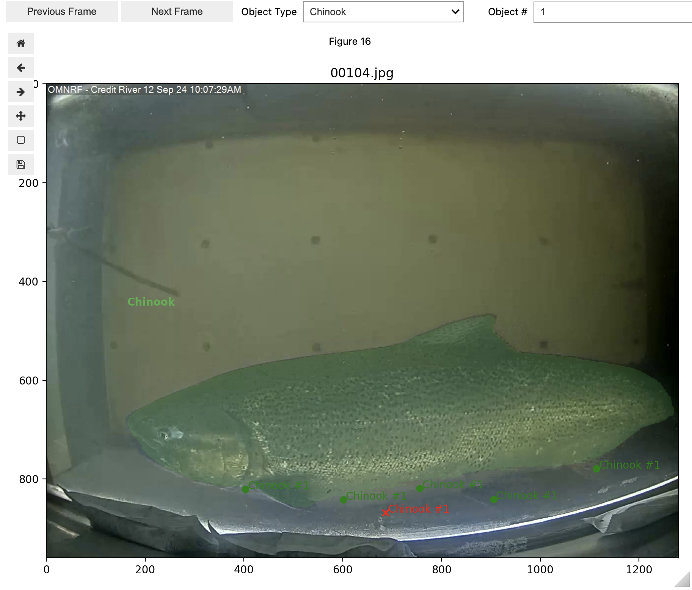
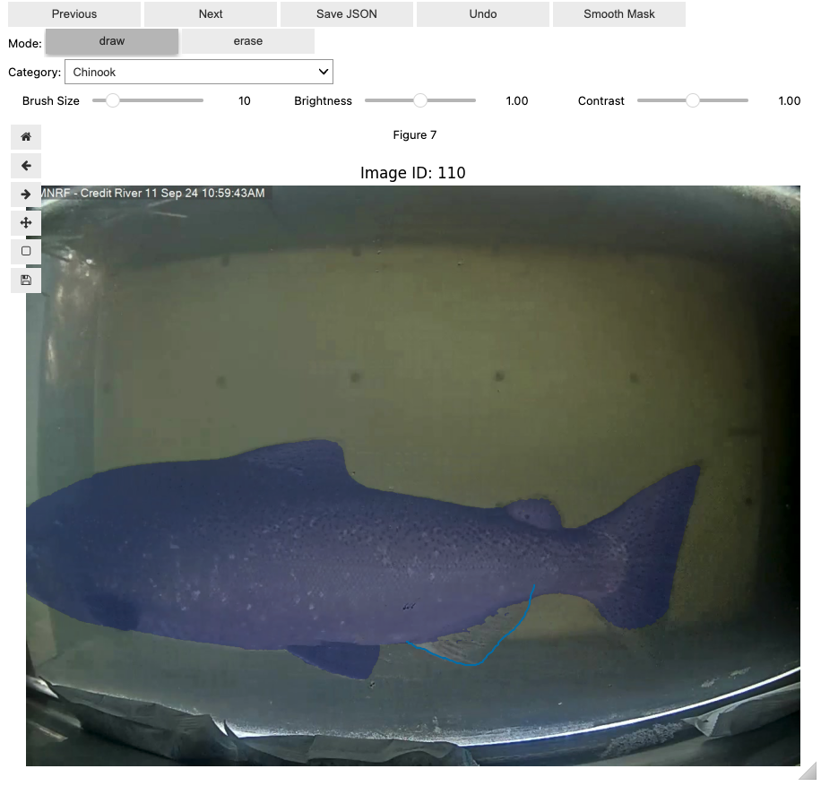
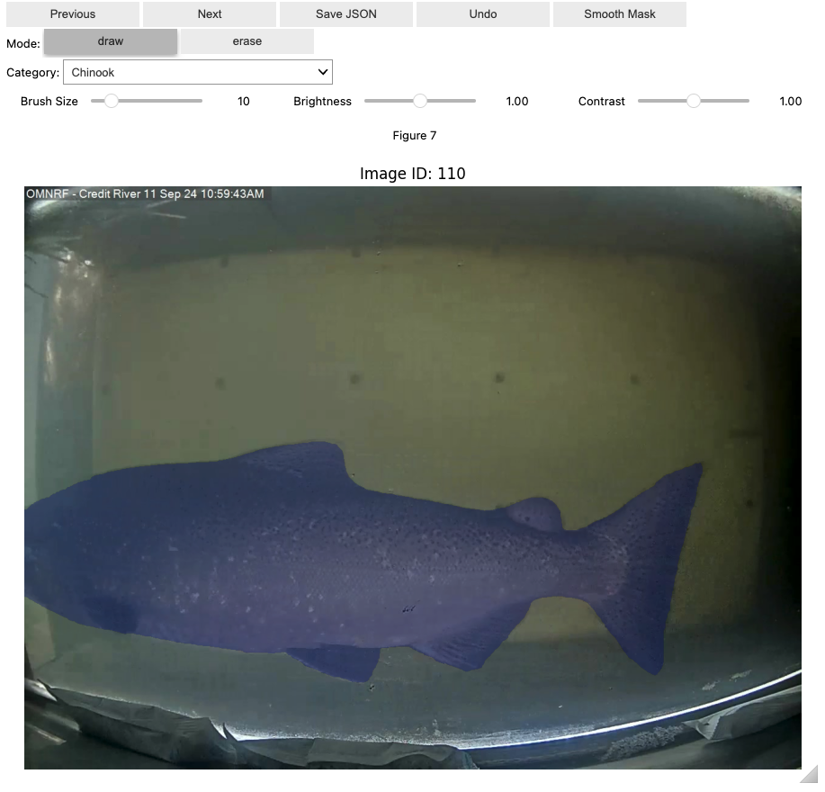

# Lake Ontario Fishway Labelling Tools

This repository contains notebooks to create mask annotations for the Lake Ontario Fishway Dataset. 

 * [LO_propagate_masks.ipynb](LO_propagate_masks.ipynb) is meant for creating masks from click prompts and proagating using [SAMv2](https://github.com/facebookresearch/sam2).
 * [LO_bbox2mask.ipynb](LO_bbox2mask.ipynb) is meant for generating masks from bounding boxes and then refining with click prompts using [SAMv2](https://github.com/facebookresearch/sam2). This notebook also contains older code and methods. It is no longer kept up to date.
 * [labelling_functions.py](labelling_functions.py) stores a lot of the functions that the these notebooks rely on.

## Getting Set-Up

1. **Create conda environment (python 3.11)**

2. **Install Packages:**

```
pip install "numpy<1.26.4"
pip install matplotlib torch torchvision pycocotools opencv-python PIL ipywidgets ipyevents tqmd
pip install 'git+https://github.com/facebookresearch/sam2.git'
conda install -c conda-forge ipympl
```

There may be some other libraries that need to be installed or updated. Make sure to install that older version of numpy before installing the other libraries. Make sure you have ffmpeg (software) installed as this is how we will create the images from the mp4 videos.

3. **Download SAMv2 Checkpoint:**

Download the model checkpoint from here: [sam2.1_hiera_large.pt](https://dl.fbaipublicfiles.com/segment_anything_2/092824/sam2.1_hiera_large.pt). This is the most up to date and largest pretrained version of SAMv2 as of now but you can check the [SAMv2 repo](https://github.com/facebookresearch/sam2) for different versions if you like. 

## How [LO_propagate_masks.ipynb](LO_propagate_masks.ipynb) Works

The `ImageAnnotationWidget` allows you to create positive and negative click prompts on frames.


The clicks are stored in a dictionary which tracks the frame number, the species, and the object number. These clicks can then provided to the SAMv2 mask predictor and the masks for each clicked frame are produced. If you are not pleased with the mask you can provide further click prompts to refine the mask.



Once you have a mask you are happy with you can propagate the mask through the rest of the video. The best workflow is to provide click prompts for the first few frames that the fish is in view and refine these masks if needed. Once part of the fish is clearly in view and the mask is easily created without refinement then you can propagate this mask through the rest of the video (indicating which frame the fish leaves the camera view).

The `MaskEditor` widget allows you to edit the auto generated masks. You can using the drawing tool to add areas to the mask or the erase tool to remove areas. 



Once you are happy with the masked area you can use smooth mask button to rid of small floating points and interior holes withing the mask. Once all masks are updated, or to save along the way, you can use the Save JSON button to export the annotations to COCO JSON format. 



